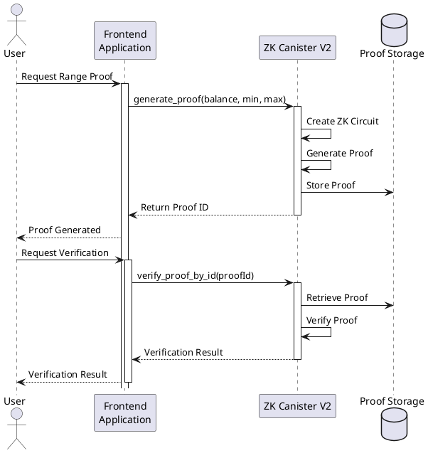

# Ghost - ZK Notary Agent Backend

A Zero-Knowledge Proof system for private attestations on the Internet Computer. This repository contains the backend/canister components of the Ghost ZK proof system, focusing on range proofs and token ownership verification.

## Repository Organization

This repository contains the backend components of the Ghost ZK proof system, focusing on the ZK canisters for proof generation and verification. The frontend application is maintained in a separate repository.

## Canister Structure

This repository contains two ZK canisters:

1. **ZK Canister V1** (`hi7bu-myaaa-aaaad-aaloa-cai`)
   - Basic zero-knowledge proof generation and verification
   - Cross-chain verification support (via Chain Fusion)
   - Provides cryptographic attestations without revealing sensitive data
   - [Candid UI](https://a4gq6-oaaaa-aaaab-qaa4q-cai.raw.ic0.app/?id=hi7bu-myaaa-aaaad-aaloa-cai)

2. **ZK Canister V2** (`bkyz2-fmaaa-aaaaa-qaaaq-cai`)
   - Enhanced proof generation using Halo2 ZK-SNARKs
   - Specialized in range proofs for token balances
   - Improved verification process with witness assignments
   - [Local Candid UI](http://127.0.0.1:8000/?canisterId=be2us-64aaa-aaaaa-qaabq-cai&id=bkyz2-fmaaa-aaaaa-qaaaq-cai)

## Getting Started

### Prerequisites

- [DFX SDK](https://internetcomputer.org/docs/current/developer-docs/build/install-dfx) (v0.15.0 or later)
- Rust (latest stable version)
- Cargo (latest stable version)
- [ic-wasm](https://github.com/dfinity/ic-wasm) for WebAssembly optimization

### Installation

```bash
# Clone this repository
git clone <repository-url>
cd ghost-backend

# Install dependencies
npm install

# Start local replica
dfx start --background

# Build and deploy locally
dfx build
dfx deploy
```

## Frontend Integration Guide

### V2 Canister Integration

The V2 canister provides two main endpoints for frontend integration:

1. **Generate Proof**
```typescript
type TokenRangeInput = {
  balance: bigint;    // The balance to prove
  min_range: bigint;  // Minimum range value
  max_range: bigint;  // Maximum range value
};

// Generate a proof
const result = await actor.generate_proof({
  balance: 1000n,
  min_range: 0n,
  max_range: 5000n
});

// Handle the result
if ('Ok' in result) {
  const proofId = result.Ok;  // Store this ID for verification
} else {
  console.error('Error:', result.Err);
}
```

2. **Verify Proof**
```typescript
// Verify a previously generated proof
const verificationResult = await actor.verify_proof_by_id(proofId);

// Handle verification result
if ('Ok' in verificationResult) {
  const isValid = verificationResult.Ok;
  console.log('Proof verification:', isValid);
} else {
  console.error('Verification error:', verificationResult.Err);
}
```

### Example Integration Flow

```typescript
import { Actor, HttpAgent } from "@dfinity/agent";
import { idlFactory } from "./declarations/zk_canister_v2.did";

// Initialize agent and actor
const agent = new HttpAgent();
const actor = Actor.createActor(idlFactory, {
  agent,
  canisterId: "bkyz2-fmaaa-aaaaa-qaaaq-cai"
});

// Generate and verify a proof
async function generateAndVerifyProof(balance: bigint, minRange: bigint, maxRange: bigint) {
  try {
    // Generate proof
    const genResult = await actor.generate_proof({
      balance,
      min_range: minRange,
      max_range: maxRange
    });
    
    if ('Err' in genResult) {
      throw new Error(genResult.Err);
    }
    
    // Verify proof
    const proofId = genResult.Ok.toString();
    const verifyResult = await actor.verify_proof_by_id(proofId);
    
    if ('Err' in verifyResult) {
      throw new Error(verifyResult.Err);
    }
    
    return verifyResult.Ok;
  } catch (error) {
    console.error('Error:', error);
    return false;
  }
}
```

## System Architecture



## Development and Testing

### Local Testing
```bash
# Generate a proof
dfx canister call zk_canister_v2 generate_proof '(record { balance = 1000 : nat64; min_range = 0 : nat64; max_range = 5000 : nat64 })'

# Verify a proof
dfx canister call zk_canister_v2 verify_proof_by_id '("proof_id")'
```

### Monitoring
```bash
# Check canister status
dfx canister status zk_canister_v2

# View canister metrics
dfx canister call zk_canister_v2 get_canister_metrics
```

## Documentation

For more detailed information, please refer to:
- [Milestone Documentation](./docs/milestone.md) - Detailed technical specifications
- [Deployment Guide](./DEPLOYMENT.md) - Deployment instructions and configurations

## License

This project is licensed under the MIT License - see the LICENSE file for details.

## Acknowledgments
- Internet Computer Foundation
- Dfinity Foundation
- Zero-Knowledge Proof community 