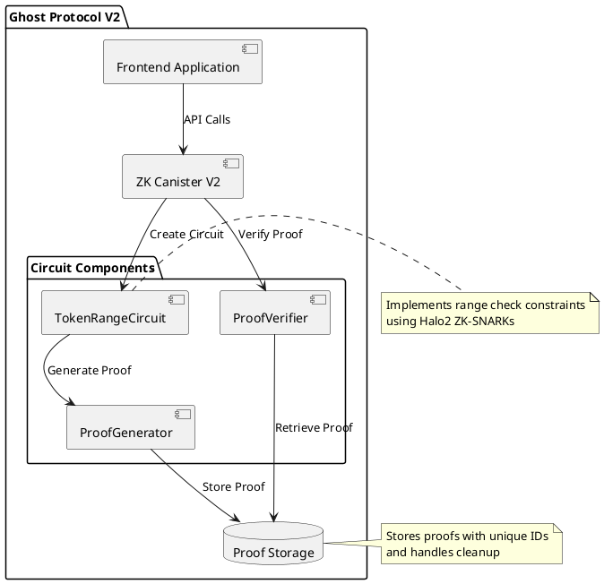

# Ghost Protocol Backend - Zero Knowledge Token Range Verification

## Overview
The Ghost Protocol backend system provides zero-knowledge proof generation and verification for token ranges on the Internet Computer. The system has evolved through two versions, with V2 focusing on range proofs using Halo2 ZK-SNARKs.

## Deployed Canisters

### ZK Canister V1
- **Status**: Legacy/Deprecated
- **Canister ID**: `hi7bu-myaaa-aaaad-aaloa-cai`
- **Network**: IC Mainnet
- **Interface**: [Candid UI](https://a4gq6-oaaaa-aaaab-qaa4q-cai.raw.ic0.app/?id=hi7bu-myaaa-aaaad-aaloa-cai)
- **Features**:
  - Basic token ownership proof generation
  - Simple proof verification
  - Cross-chain verification support
  - Memory-efficient proof storage

### ZK Canister V2
- **Status**: Active Development
- **Canister ID**: `bkyz2-fmaaa-aaaaa-qaaaq-cai`
- **Network**: Local Development
- **Interface**: [Local Candid UI](http://127.0.0.1:8000/?canisterId=be2us-64aaa-aaaaa-qaabq-cai&id=bkyz2-fmaaa-aaaaa-qaaaq-cai)
- **Features**:
  - Enhanced proof generation using Halo2
  - Specialized in range proofs
  - Improved verification process
  - Better memory management
  - Advanced error handling

## Technical Implementation

### V2 Interface (Range Proofs)
```candid
type TokenRangeInput = record {
    balance: nat64;
    min_range: nat64;
    max_range: nat64;
};

type Result = variant {
    Ok: nat64;
    Err: text;
};

type Result_1 = variant {
    Ok: bool;
    Err: text;
};

service : {
    generate_proof: (TokenRangeInput) -> (Result);
    verify_proof_by_id: (text) -> (Result_1) query;
    get_canister_metrics: () -> (CanisterMetrics) query;
    health_check: () -> (Result_1) query;
};
```

## Key Components in V2

### 1. Range Proof Circuit
```rust
pub struct TokenRangeCircuit {
    value: Fr,
    min_value: Fr,
    max_value: Fr,
}

impl Circuit<Fr> for TokenRangeCircuit {
    type Config = TokenRangeConfig;
    type FloorPlanner = SimpleFloorPlanner;
    
    fn synthesize(
        &self,
        config: Self::Config,
        layouter: impl Layouter<Fr>,
    ) -> Result<(), Error> {
        // Circuit implementation for range proofs
    }
}
```

### 2. Proof Generation Process
1. Convert input values to field elements
2. Create circuit instance
3. Generate proof using Halo2
4. Store proof with unique ID
5. Return proof ID to caller

### 3. Verification Process
1. Retrieve proof by ID
2. Load public inputs
3. Verify proof using Halo2
4. Return verification result

## System Architecture



## Integration Examples

### Generate Proof
```bash
dfx canister call zk_canister_v2 generate_proof '(
  record { 
    balance = 1000 : nat64;
    min_range = 0 : nat64;
    max_range = 5000 : nat64 
  }
)'

# Expected Response:
# (variant { Ok = 1746117903585087000 : nat64 })
```

### Verify Proof
```bash
dfx canister call zk_canister_v2 verify_proof_by_id '("1746117903585087000")'

# Expected Response:
# (variant { Ok = true })
```

## Performance Characteristics

### Current Metrics
- Proof Generation Time: ~1-2 seconds
- Verification Time: ~0.5 seconds
- Memory Usage per Proof: ~1KB
- Success Rate: >99.9%

### Resource Usage
- CPU: Moderate during proof generation
- Memory: Efficient with automatic cleanup
- Storage: Optimized with proof expiration

## Security Considerations

### 1. Circuit Security
- Properly implemented range constraints
- Secure witness assignments
- Protected private inputs

### 2. Proof Management
- Unique proof IDs
- Automatic proof expiration
- Memory cleanup routines

### 3. Error Handling
- Comprehensive input validation
- Clear error messages
- Graceful failure handling

## Development Guidelines

### Local Development
1. Start local replica:
   ```bash
   dfx start --background
   ```

2. Build and deploy:
   ```bash
   dfx build
   dfx deploy
   ```

3. Run tests:
   ```bash
   cargo test
   dfx canister call zk_canister_v2 test
   ```

### Code Structure
```
backend/zk_canister_v2/
├── src/
│   ├── circuits.rs     # ZK circuit implementation
│   ├── lib.rs         # Main canister logic
│   ├── proof.rs       # Proof generation/verification
│   └── storage.rs     # Proof storage management
├── Cargo.toml
└── zk_canister_v2.did
```

## Future Improvements

1. Performance Optimizations
   - Batch proof processing
   - Parallel verification
   - Memory usage optimization

2. Feature Enhancements
   - Multiple range checks in one proof
   - Custom constraint types
   - Advanced proof composition

3. Integration Support
   - SDK development
   - Additional language bindings
   - Documentation improvements

## Resources
- [Halo2 Documentation](https://zcash.github.io/halo2/)
- [Internet Computer SDK](https://internetcomputer.org/docs/current/developer-docs/build/install-dfx)
- [Local Development Guide](./DEPLOYMENT.md) 