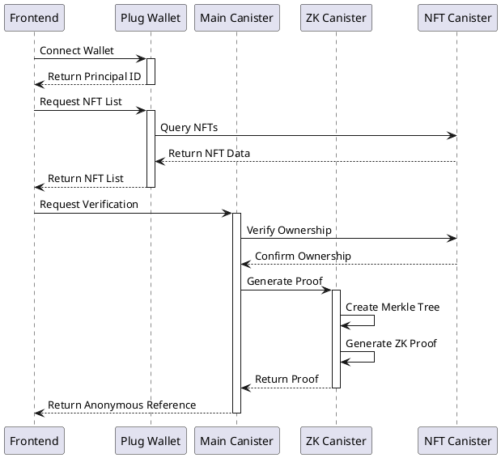
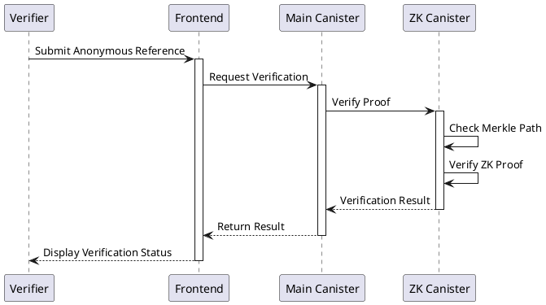
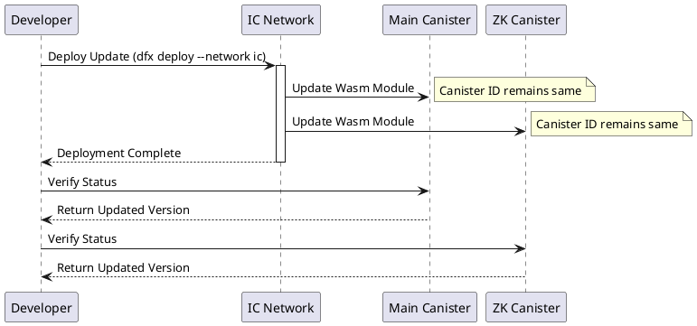

# Milestone 1: Core Proof System Documentation

## Deliverables we submitted
Milestone 1: MVP - Core Proof System
- Deploy a canister-based ZK proof system for private attestations
Definition of Done: A working canister that can accept user input and generate a Zero-Knowledge Proof (ZKP) for a given use case (e.g., holding or token ownership).

- Develop a simple frontend for proof requests (ONE use case will be selected)
Definition of Done: A basic web interface where users can connect their wallet, select a proof type, and request a ZKP.

- Implement anonymous reference generation for proof verification
Definition of Done: A unique, shareable proof link that third parties can use to verify the validity of a ZKP.

- Test execution with an initial use case (ONE use case)
Definition of Done: Successful end-to-end testing of a complete proof request, generation, and verification cycle. A test script and a demo video will be available.


## Overview
This milestone implements a canister-based Zero-Knowledge Proof (ZKP) system for private attestations, focusing on token ownership verification. The system allows users to prove they own an token without revealing their identity.

## Components
1. **ZK Canister** (`hi7bu-myaaa-aaaad-aaloa-cai`)
   - Handles proof generation and verification
   - Processes NFT ownership claims
   - Manages Merkle tree operations

2. **Main Canister** (`hp6ha-baaaa-aaaad-aaloq-cai`)
   - Manages user interactions
   - Handles wallet connections
   - Processes verification requests

3. **Frontend Interface**
   - Wallet connection
   - NFT selection
   - Proof generation requests
   - Anonymous reference handling

## System Architecture

### 1. NFT Verification Flow


### 2. Proof Verification Flow


### 3. System Update Flow


## Testing Methods

### 1. Frontend Testing
1. Visit the application URL
2. Connect your Plug wallet:
   - Click "Connect Wallet"
   - Approve the connection request
   - Ensure your wallet has at least one NFT
3. Select an NFT:
   - View your NFT collection
   - Choose an NFT to verify
4. Generate Proof:
   - Click "Generate Proof"
   - Wait for proof generation
   - Copy the anonymous reference
5. Verify Proof:
   - Use the anonymous reference link
   - Confirm the verification status

### 2. Code Inspection
1. **Wallet Integration** (`src/lib/wallet/index.ts`):
```typescript
// Check wallet connection
const connected = await window.ic.plug.requestConnect({
  whitelist: [ZK_CANISTER_ID],
  host: IC_HOST
})
```

2. **Proof Generation** (`src/services/api.ts`):
```typescript
// Generate ZK proof
const proofResult = await zkActor.generateProof({
  nft_merkle_path,
  token_id,
  collection_id,
  // ... other parameters
})
```

3. **Verification Flow** (`src/components/features/proof-generator/index.tsx`):
```typescript
// Verify NFT ownership and generate proof
const result = await verifyNftOwnership({
  walletAddress,
  itemId,
  chainId: 'icp'
})
```

### 3. Automated Testing
1. Run the test script:
```bash
./scripts/run_milestone1_test.sh
```

2. Test Components:
   - Wallet connection
   - NFT data fetching
   - Proof generation
   - Proof verification
   - Anonymous reference creation

## Test Report Template

### Test Execution Report
```markdown
# Milestone 1 Test Report

Date: [DATE]
Environment: [NETWORK]
Tester: [NAME]

## Test Cases

1. Wallet Connection
   - Status: [PASS/FAIL]
   - Principal: [PRINCIPAL_ID]
   - Notes: [OBSERVATIONS]

2. NFT Verification
   - Status: [PASS/FAIL]
   - NFT Details:
     - Contract: [CONTRACT_ADDRESS]
     - Token ID: [TOKEN_ID]
   - Notes: [OBSERVATIONS]

3. Proof Generation
   - Status: [PASS/FAIL]
   - Proof ID: [PROOF_ID]
   - Notes: [OBSERVATIONS]

4. Anonymous Reference
   - Status: [PASS/FAIL]
   - Reference: [REFERENCE_ID]
   - Verification Link: [LINK]
   - Notes: [OBSERVATIONS]

## Issues Found
1. [ISSUE_DESCRIPTION]
   - Severity: [HIGH/MEDIUM/LOW]
   - Steps to Reproduce: [STEPS]

## Recommendations
1. [RECOMMENDATION]
```

## Deployment

### Environment Setup
1. Update `.env.production`:
```env
VITE_MAIN_CANISTER_ID=hp6ha-baaaa-aaaad-aaloq-cai
VITE_ZK_CANISTER_ID=hi7bu-myaaa-aaaad-aaloa-cai
VITE_IC_HOST=https://ic0.app
VITE_USE_MOCK_DATA=false
```

2. Deploy canisters:
```bash
dfx build --network ic
dfx deploy --network ic
```

### Verification
1. Check canister status:
```bash
dfx canister --network ic status main_canister
dfx canister --network ic status zk_canister
```

2. Verify frontend connection:
```bash
curl https://ic0.app/api/v2/canister/[CANISTER_ID]/query
```

## Security Considerations
1. **Wallet Security**
   - Always verify wallet connection status
   - Check whitelist configuration
   - Validate principal IDs

2. **Proof Generation**
   - Validate all input parameters
   - Ensure proper Merkle tree construction
   - Verify proof integrity

3. **Anonymous References**
   - Use cryptographically secure random generation
   - Implement proper expiration handling
   - Validate reference format

## Troubleshooting
1. **Wallet Connection Issues**
   - Ensure Plug wallet is installed
   - Check network connectivity
   - Verify whitelist configuration

2. **Proof Generation Failures**
   - Validate NFT ownership
   - Check canister connectivity
   - Verify input parameters

3. **Verification Errors**
   - Check anonymous reference validity
   - Verify proof expiration
   - Validate verification parameters

## Next Steps
1. **Performance Optimization**
   - Implement proof caching
   - Optimize Merkle tree operations
   - Add batch processing

2. **Feature Enhancement**
   - Add support for multiple NFTs
   - Implement proof expiration
   - Add detailed proof metadata

3. **Security Hardening**
   - Add rate limiting
   - Implement proof revocation
   - Add audit logging 