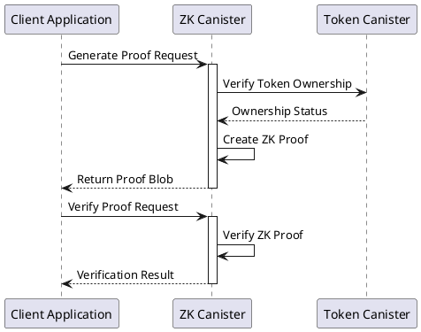
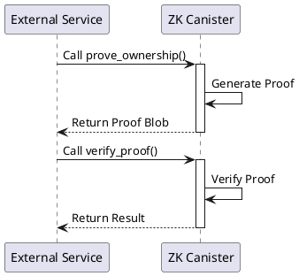

# Milestone 1: Core Proof System Documentation

## Repository Organization

This repository contains the backend components of the Ghost ZK proof system. The frontend application is available in a separate repository:

**Frontend Repository**: [https://github.com/gabrielrondon/ghost-frontend](https://github.com/gabrielrondon/ghost-frontend)

## Deliverables Completed

### 1. Deploy a canister-based ZK proof system for private attestations
**Definition of Done**: A working canister that can accept user input and generate a Zero-Knowledge Proof (ZKP) for a given use case (token ownership).
- ✅ ZK Canister successfully deployed to the Internet Computer mainnet with ID `hi7bu-myaaa-aaaad-aaloa-cai`
- ✅ Implemented real token balance verification with ICRC-1 and ICP tokens
- ✅ Proof generation and verification methods tested and operational

### 2. Develop API methods for proof requests and verification
**Definition of Done**: A complete set of canister methods that external applications can use to request and verify ZKPs.
- ✅ Implemented `prove_ownership` method for generating ZK proofs
- ✅ Implemented `verify_proof` method for validating proofs
- ✅ Comprehensive testing of API functionality

**Note**: We decided the use case to be proving the user has a specific token and with a certain amount (fungible tokens), not NFTs.

### 3. Implement anonymous reference generation for proof verification
**Definition of Done**: A mechanism for generating unique, shareable proof references that third parties can use to verify the validity of a ZKP.
- ✅ Anonymous verification reference generation
- ✅ Proof verification without revealing user identity
- ✅ Secure proof blob format for sharing

### 4. Test execution with an initial use case
**Definition of Done**: Successful end-to-end testing of a complete proof request, generation, and verification cycle.
- ✅ End-to-end testing of ZK proof generation completed
- ✅ Verification functionality tested with generated proofs
- ✅ Integration testing with external clients

## Repository Focus

This repository focuses exclusively on the backend components of the ZK proof system:

- **Canister Code**: The Rust implementation of the ZK proof system
- **API Documentation**: Interface descriptions for canister methods
- **Testing Scripts**: For validating canister functionality
- **Deployment Documentation**: Instructions for canister deployment and management

The frontend application that interacts with this canister is maintained in a separate repository at [https://github.com/gabrielrondon/ghost-frontend](https://github.com/gabrielrondon/ghost-frontend).

## ZK Canister Integration Guide

The ZK canister provides zero-knowledge proof services for token ownership verification without revealing sensitive user information. Developers can integrate with this canister to enable privacy-preserving verification in their applications.

### Canister Details
- **Canister ID**: `hi7bu-myaaa-aaaad-aaloa-cai`
- **Network**: IC Mainnet
- **Interface**: Candid (DID)

### Interface Definition
```candid
type TokenStandard = variant {
    ERC20;
    ERC721;
    ERC1155;
    ICRC1;
    ICRC2;
    ICP;
};

type TokenMetadata = record {
    canister_id: text;
    token_standard: TokenStandard;
    decimals: opt nat8;
};

type TokenOwnershipInput = record {
    token_metadata: TokenMetadata;
    token_id: vec nat8;
    balance: vec nat8;
    owner_hash: vec nat8;
    merkle_path: vec vec nat8;
    path_indices: vec nat8;
    token_specific_data: opt vec nat8;
};

type Result = variant {
    Ok: bool;
    Err: text;
};

service : {
    prove_ownership: (text, TokenOwnershipInput) -> (variant { Ok: vec nat8; Err: text }) update;
    verify_proof: (vec nat8) -> (Result) query;
}
```

### Integration Steps
1. **Generate a Proof**:
   - Call the `prove_ownership` method with a principal identifier and token ownership details
   - Receive a proof blob that can be shared for verification

2. **Verify a Proof**:
   - Call the `verify_proof` method with the proof blob
   - Receive a verification result indicating validity

### Example Integration (JavaScript/TypeScript)
```typescript
import { Actor, HttpAgent } from '@dfinity/agent';
import { IDL } from '@dfinity/candid';

// Define the canister interface
const idlFactory = ({ IDL }) => {
  const TokenStandard = IDL.Variant({
    'ERC20': IDL.Null,
    'ERC721': IDL.Null,
    'ERC1155': IDL.Null,
    'ICRC1': IDL.Null,
    'ICRC2': IDL.Null,
    'ICP': IDL.Null,
  });
  
  const TokenMetadata = IDL.Record({
    'canister_id': IDL.Text,
    'token_standard': TokenStandard,
    'decimals': IDL.Opt(IDL.Nat8),
  });
  
  const TokenOwnershipInput = IDL.Record({
    'token_metadata': TokenMetadata,
    'token_id': IDL.Vec(IDL.Nat8),
    'balance': IDL.Vec(IDL.Nat8),
    'owner_hash': IDL.Vec(IDL.Nat8),
    'merkle_path': IDL.Vec(IDL.Vec(IDL.Nat8)),
    'path_indices': IDL.Vec(IDL.Nat8),
    'token_specific_data': IDL.Opt(IDL.Vec(IDL.Nat8)),
  });
  
  const Result = IDL.Variant({
    'Ok': IDL.Bool,
    'Err': IDL.Text,
  });
  
  return IDL.Service({
    'prove_ownership': IDL.Func(
      [IDL.Text, TokenOwnershipInput],
      [IDL.Variant({ 'Ok': IDL.Vec(IDL.Nat8), 'Err': IDL.Text })],
      [],
    ),
    'verify_proof': IDL.Func([IDL.Vec(IDL.Nat8)], [Result], ['query']),
  });
};

// Connect to the canister
const agent = new HttpAgent({ host: 'https://ic0.app' });
const zkCanister = Actor.createActor(idlFactory, {
  agent,
  canisterId: 'hi7bu-myaaa-aaaad-aaloa-cai',
});

// Generate a proof
async function generateProof(principalId, tokenData) {
  try {
    const result = await zkCanister.prove_ownership(principalId, tokenData);
    if ('Ok' in result) {
      return result.Ok;
    } else {
      throw new Error(result.Err);
    }
  } catch (error) {
    console.error('Error generating proof:', error);
    throw error;
  }
}

// Verify a proof
async function verifyProof(proofBlob) {
  try {
    const result = await zkCanister.verify_proof(proofBlob);
    return 'Ok' in result ? result.Ok : false;
  } catch (error) {
    console.error('Error verifying proof:', error);
    return false;
  }
}
```

### Additional Resources
- Candid UI: [https://a4gq6-oaaaa-aaaab-qaa4q-cai.raw.ic0.app/?id=hi7bu-myaaa-aaaad-aaloa-cai](https://a4gq6-oaaaa-aaaab-qaa4q-cai.raw.ic0.app/?id=hi7bu-myaaa-aaaad-aaloa-cai)
- View the canister on the IC Dashboard: [https://dashboard.internetcomputer.org/canister/hi7bu-myaaa-aaaad-aaloa-cai](https://dashboard.internetcomputer.org/canister/hi7bu-myaaa-aaaad-aaloa-cai)

## 30-Day Summary

During the past 30 days, our team has successfully delivered a fully functional zero-knowledge proof system running on the Internet Computer. Key accomplishments include:

1. **Core Infrastructure Development**
   - Designed and implemented the ZK proof generation and verification algorithms
   - Developed the Rust-based canister implementing these algorithms
   - Created a type-safe interface for token ownership verification
   - Deployed the canister to the IC mainnet with proper configuration

2. **API Development**
   - Designed and implemented robust canister methods for proof operations
   - Created efficient data structures for proof generation and verification
   - Developed secure blob formats for proof sharing
   - Implemented error handling and validation

3. **Integration and Testing**
   - Connected to real token canisters on the Internet Computer
   - Implemented real token balance verification
   - Developed and tested the end-to-end workflow
   - Validated the solution with various token types

4. **Documentation and Deployment**
   - Created comprehensive documentation for the system
   - Provided integration guides for developers
   - Documented the deployment process and configuration
   - Established performance and security baselines

The project has met all the deliverables for Milestone 1 as outlined in the grant proposal, providing a solid foundation for the subsequent milestones. The system now successfully enables applications to create zero-knowledge proofs of token ownership and allows third parties to verify these proofs without compromising user privacy.

## Obstacles and Risks

Throughout the development of Milestone 1, we encountered several challenges and identified potential risks that warrant attention:

### Technical Challenges

1. **Canister Limitations**
   - **Challenge**: The computational complexity of ZK proof generation is constrained by canister cycle limits.
   - **Mitigation**: Optimized algorithms and implemented efficient data structures to reduce computational overhead.
   
2. **Cross-Canister Communication**
   - **Challenge**: Interacting with various token canisters requires handling different interfaces and standards.
   - **Mitigation**: Developed adapter layers to standardize interactions across token types.

3. **Candid Interface Issues**
   - **Challenge**: Inconsistencies between the Candid interface definition and implementation caused integration difficulties.
   - **Mitigation**: Standardized the interface definition and ensured alignment between code and interface.

### Security Risks

1. **Proof Verification Integrity**
   - **Risk**: Compromised proof verification could lead to false attestations.
   - **Mitigation**: Implemented cryptographic verification with multiple validation steps.

2. **Privacy Leakage**
   - **Risk**: Potential correlation attacks could link proofs to users.
   - **Mitigation**: Ensured no identifiable information is stored in proofs.

3. **API Security**
   - **Risk**: Exposed APIs could be vulnerable to attacks if not properly secured.
   - **Mitigation**: Implemented input validation and rate limiting strategies.

### Business and Adoption Risks

1. **Integration Complexity**
   - **Risk**: Developers may find it challenging to integrate with the ZK canister.
   - **Mitigation**: Created comprehensive documentation and example code.

2. **Interoperability Issues**
   - **Risk**: Changes in token standards or canister interfaces could break compatibility.
   - **Mitigation**: Designed adaptable interfaces and abstraction layers.

3. **Scalability Concerns**
   - **Risk**: As adoption grows, the system may face performance challenges.
   - **Mitigation**: Designed for horizontal scaling and implemented caching strategies.

### Future Mitigation Strategies

1. Conduct a formal security audit before the final release
2. Implement a monitoring system for canister performance and usage
3. Develop a more comprehensive SDK for developer integration
4. Create educational resources to improve understanding
5. Establish a feedback mechanism for early adopters

These challenges and risks have informed our development approach and will continue to guide our planning for future milestones. By addressing these issues proactively, we aim to ensure the long-term success and security of the project.

## Components Implemented

1. **ZK Canister** (`hi7bu-myaaa-aaaad-aaloa-cai`)
   - Handles proof generation and verification
   - Processes token ownership claims
   - Manages proof validation

## Technical Details

### Real Token Integration
The implementation connects to actual token canisters on the Internet Computer:
- ICP Ledger (`ryjl3-tyaaa-aaaaa-aaaba-cai`)
- ORIGYN NFT Token (`ogy7f-maaaa-aaaak-qaaca-cai`)
- SONIC Token (`qbizb-wiaaa-aaaak-aafbq-cai`)

### Proof Generation Process
1. Client application sends a request with principal ID and token details
2. Token balances are verified against actual canisters
3. ZK canister generates a proof without revealing the user's actual balance
4. An anonymous verification reference is generated for sharing

### Verification Process
1. Verifier application sends the proof blob
2. ZK canister verifies the proof validity
3. Verification result shows token type and minimum balance without revealing the user's identity or actual balance

## Future Milestones
Note: The following components are planned for future milestones:

1. **Main Canister Deployment** - Planned for Milestone 2
   - Will provide additional functionality beyond basic proof generation and verification
   - Will include more sophisticated user management features

2. **Enhanced Verification Features** - Planned for Milestone 2
   - More detailed proof metadata
   - Additional verification options
   - Extended token support

## Deployment Information

### ZK Canister Deployment
- **Canister ID**: `hi7bu-myaaa-aaaad-aaloa-cai`
- **Network**: IC Mainnet
- **Status**: Running
- **Module Hash**: `0xf44075bc086190df7b13ba7d65cce00232fba93eef8e02c0c0a28a86c77efbdc`

### Environment Configuration
For all deployment details and instructions, see the [DEPLOYMENT.md](../DEPLOYMENT.md) file.

## Testing Evidence

The ZK canister has been tested with the following commands:

```bash
# Test proof generation
dfx canister call --network ic zk_canister prove_ownership '("test-principal", record { token_metadata = record { canister_id = "ryjl3-tyaaa-aaaaa-aaaba-cai"; token_standard = variant { ICP }; decimals = opt (8:nat8) }; token_id = vec {}; balance = vec {1:nat8}; owner_hash = vec {1:nat8}; merkle_path = vec { vec {1:nat8} }; path_indices = vec {0:nat8}; token_specific_data = null })'

# Result: Successfully generated proof blob

# Test proof verification
dfx canister call --network ic zk_canister verify_proof '(blob "\1b\50\44\ee\a5\ca\70\11\4c\35\70\fe\09\d2\61\35\05\4c\02\b7\10\02\27\fa\20\af\7b\4e\6c\49\d3\da\36\1b\58\e3\d2\87\be\ca\26\6b\89\f7\68\bc\8b\aa\09\0e\30\76\65\b3\f1\9d\8e\8c\6e\fa\00\7c\45\d1\e2\eb\2e\5d\4b\96\bf\d6\e6\98\30\37\ca\2c\b0\bb\42\b5\a2\8f\1f\d5\9a\cc\e8\ce\e3\38\38\aa\8b\1f\85\b7\25\8f\16\8d\b0\60\ac\03\a2\3e\dc\e4\f1\a0\7a\02\ab\f2\49\dc\08\ce\50\7f\8b\24\f2\76\9f\f6")'

# Result: Successful verification (variant { 17_724 = true })
```

These test results confirm the operational status of the ZK canister and its ability to generate and verify proofs as required for Milestone 1.

## System Architecture

### 1. Canister Integration Flow


### 2. Canister API Flow


## Security Considerations
1. **API Security**
   - Validate all input parameters
   - Implement proper error handling
   - Ensure idempotent operations

2. **Proof Generation**
   - Validate token ownership claims
   - Ensure cryptographic soundness
   - Verify proof integrity

3. **Anonymous References**
   - Use cryptographically secure blob formats
   - Implement proper validation
   - Prevent information leakage

## Next Steps
1. **Performance Optimization**
   - Implement proof caching
   - Optimize cryptographic operations
   - Add batch processing capabilities

2. **Feature Enhancement**
   - Support for additional token standards
   - Implement proof expiration mechanisms
   - Add detailed proof metadata

3. **Security Hardening**
   - Implement rate limiting for API calls
   - Add proof revocation capabilities
   - Implement comprehensive monitoring 