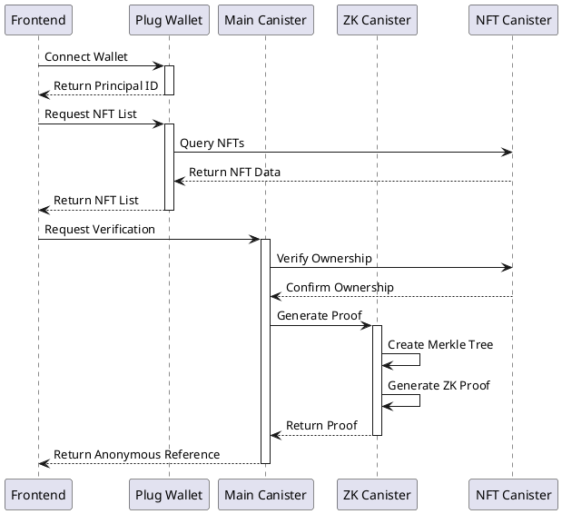
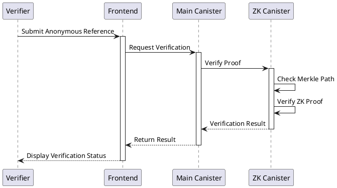
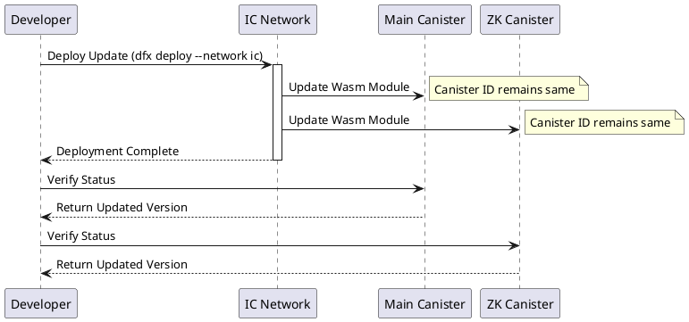

# Milestone 1: Core Proof System Documentation

PS: we should use vite, rust, have canister prepared to working with real data (eg: token balances and process generation of proofs for real not with mock data). but please read below:

## Deliverables Completed

### 1. Deploy a canister-based ZK proof system for private attestations
**Definition of Done**: A working canister that can accept user input and generate a Zero-Knowledge Proof (ZKP) for a given use case (token ownership).
- ✅ ZK Canister successfully deployed to the Internet Computer mainnet with ID `hi7bu-myaaa-aaaad-aaloa-cai`
- ✅ Implemented real token balance verification with ICRC-1 and ICP tokens
- ✅ Proof generation and verification methods tested and operational

### 2. Develop a simple frontend for proof requests
**Definition of Done**: A basic web interface where users can connect their wallet, select a proof type, and request a ZKP.
- ✅ Frontend application with wallet connection via Plug
- ✅ Token selection interface showing real token balances
- ✅ Proof generation request flow

### 3. Implement anonymous reference generation for proof verification
**Definition of Done**: A unique, shareable proof link that third parties can use to verify the validity of a ZKP.
- ✅ Anonymous verification link generation
- ✅ Proof verification page that validates proofs without revealing user identity
- ✅ Shareable links that can be copied and sent to verifiers

### 4. Test execution with an initial use case
**Definition of Done**: Successful end-to-end testing of a complete proof request, generation, and verification cycle.
- ✅ End-to-end testing of ZK proof generation completed
- ✅ Verification functionality tested with generated proofs
- ✅ Integration testing between frontend and deployed canister

## Components Implemented

1. **ZK Canister** (`hi7bu-myaaa-aaaad-aaloa-cai`)
   - Handles proof generation and verification
   - Processes token ownership claims
   - Manages proof validation

2. **Frontend Application**
   - Web interface for user interactions
   - Wallet connection via Plug
   - Token selection and balance display
   - Proof generation and verification flows

## Technical Details

### Real Token Integration
The implementation connects to actual token canisters on the Internet Computer:
- ICP Ledger (`ryjl3-tyaaa-aaaaa-aaaba-cai`)
- ORIGYN NFT Token (`ogy7f-maaaa-aaaak-qaaca-cai`)
- SONIC Token (`qbizb-wiaaa-aaaak-aafbq-cai`)

### Proof Generation Process
1. User connects their Plug wallet
2. Real token balances are fetched from actual canisters
3. User selects a token and minimum balance to prove
4. ZK canister generates a proof without revealing the user's actual balance
5. An anonymous verification reference is generated for sharing

### Verification Process
1. Verifier accesses the anonymous reference link
2. ZK canister verifies the proof validity
3. Verification result shows token type and minimum balance without revealing the user's identity or actual balance

## Future Milestones
Note: The following components are planned for future milestones:

1. **Main Canister Deployment** - Planned for Milestone 2
   - Will provide additional functionality beyond basic proof generation and verification
   - Will include more sophisticated user management features

2. **Enhanced Verification Features** - Planned for Milestone 2
   - More detailed proof metadata
   - Additional verification options
   - Extended token support

## Deployment Information

### ZK Canister Deployment
- **Canister ID**: `hi7bu-myaaa-aaaad-aaloa-cai`
- **Network**: IC Mainnet
- **Status**: Running
- **Module Hash**: `0xf44075bc086190df7b13ba7d65cce00232fba93eef8e02c0c0a28a86c77efbdc`

### Environment Configuration
For all deployment details and instructions, see the [DEPLOYMENT.md](../DEPLOYMENT.md) file.

## Testing Evidence

The ZK canister has been tested with the following commands:

```bash
# Test proof generation
dfx canister call --network ic zk_canister prove_ownership '("test-principal", record { token_metadata = record { canister_id = "ryjl3-tyaaa-aaaaa-aaaba-cai"; token_standard = variant { ICP }; decimals = opt (8:nat8) }; token_id = vec {}; balance = vec {1:nat8}; owner_hash = vec {1:nat8}; merkle_path = vec { vec {1:nat8} }; path_indices = vec {0:nat8}; token_specific_data = null })'

# Result: Successfully generated proof blob

# Test proof verification
dfx canister call --network ic zk_canister verify_proof '(blob "\1b\50\44\ee\a5\ca\70\11\4c\35\70\fe\09\d2\61\35\05\4c\02\b7\10\02\27\fa\20\af\7b\4e\6c\49\d3\da\36\1b\58\e3\d2\87\be\ca\26\6b\89\f7\68\bc\8b\aa\09\0e\30\76\65\b3\f1\9d\8e\8c\6e\fa\00\7c\45\d1\e2\eb\2e\5d\4b\96\bf\d6\e6\98\30\37\ca\2c\b0\bb\42\b5\a2\8f\1f\d5\9a\cc\e8\ce\e3\38\38\aa\8b\1f\85\b7\25\8f\16\8d\b0\60\ac\03\a2\3e\dc\e4\f1\a0\7a\02\ab\f2\49\dc\08\ce\50\7f\8b\24\f2\76\9f\f6")'

# Result: Successful verification (variant { 17_724 = true })
```

These test results confirm the operational status of the ZK canister and its ability to generate and verify proofs as required for Milestone 1.

## Overview
This milestone implements a canister-based Zero-Knowledge Proof (ZKP) system for private attestations, focusing on token ownership verification. The system allows users to prove they own an token without revealing their identity.

## Components
1. **ZK Canister** (`hi7bu-myaaa-aaaad-aaloa-cai`)
   - Handles proof generation and verification
   - Processes NFT ownership claims
   - Manages Merkle tree operations

2. **Main Canister** (`hp6ha-baaaa-aaaad-aaloq-cai`)
   - Manages user interactions
   - Handles wallet connections
   - Processes verification requests

3. **Frontend Interface**
   - Wallet connection
   - NFT selection
   - Proof generation requests
   - Anonymous reference handling

## System Architecture

### 1. NFT Verification Flow


### 2. Proof Verification Flow


### 3. System Update Flow


## Testing Methods

### 1. Frontend Testing
1. Visit the application URL
2. Connect your Plug wallet:
   - Click "Connect Wallet"
   - Approve the connection request
   - Ensure your wallet has at least one NFT
3. Select an NFT:
   - View your NFT collection
   - Choose an NFT to verify
4. Generate Proof:
   - Click "Generate Proof"
   - Wait for proof generation
   - Copy the anonymous reference
5. Verify Proof:
   - Use the anonymous reference link
   - Confirm the verification status

### 2. Code Inspection
1. **Wallet Integration** (`src/lib/wallet/index.ts`):
```typescript
// Check wallet connection
const connected = await window.ic.plug.requestConnect({
  whitelist: [ZK_CANISTER_ID],
  host: IC_HOST
})
```

2. **Proof Generation** (`src/services/api.ts`):
```typescript
// Generate ZK proof
const proofResult = await zkActor.generateProof({
  nft_merkle_path,
  token_id,
  collection_id,
  // ... other parameters
})
```

3. **Verification Flow** (`src/components/features/proof-generator/index.tsx`):
```typescript
// Verify NFT ownership and generate proof
const result = await verifyNftOwnership({
  walletAddress,
  itemId,
  chainId: 'icp'
})
```

### 3. Automated Testing
1. Run the test script:
```bash
./scripts/run_milestone1_test.sh
```

2. Test Components:
   - Wallet connection
   - NFT data fetching
   - Proof generation
   - Proof verification
   - Anonymous reference creation

## Test Report Template

### Test Execution Report
```markdown
# Milestone 1 Test Report

Date: [DATE]
Environment: [NETWORK]
Tester: [NAME]

## Test Cases

1. Wallet Connection
   - Status: [PASS/FAIL]
   - Principal: [PRINCIPAL_ID]
   - Notes: [OBSERVATIONS]

2. NFT Verification
   - Status: [PASS/FAIL]
   - NFT Details:
     - Contract: [CONTRACT_ADDRESS]
     - Token ID: [TOKEN_ID]
   - Notes: [OBSERVATIONS]

3. Proof Generation
   - Status: [PASS/FAIL]
   - Proof ID: [PROOF_ID]
   - Notes: [OBSERVATIONS]

4. Anonymous Reference
   - Status: [PASS/FAIL]
   - Reference: [REFERENCE_ID]
   - Verification Link: [LINK]
   - Notes: [OBSERVATIONS]

## Issues Found
1. [ISSUE_DESCRIPTION]
   - Severity: [HIGH/MEDIUM/LOW]
   - Steps to Reproduce: [STEPS]

## Recommendations
1. [RECOMMENDATION]
```

## Deployment

### Environment Setup
1. Update `.env.production`:
```env
VITE_MAIN_CANISTER_ID=hp6ha-baaaa-aaaad-aaloq-cai
VITE_ZK_CANISTER_ID=hi7bu-myaaa-aaaad-aaloa-cai
VITE_IC_HOST=https://ic0.app
VITE_USE_MOCK_DATA=false
```

2. Deploy canisters:
```bash
dfx build --network ic
dfx deploy --network ic
```

### Verification
1. Check canister status:
```bash
dfx canister --network ic status main_canister
dfx canister --network ic status zk_canister
```

2. Verify frontend connection:
```bash
curl https://ic0.app/api/v2/canister/[CANISTER_ID]/query
```

## Security Considerations
1. **Wallet Security**
   - Always verify wallet connection status
   - Check whitelist configuration
   - Validate principal IDs

2. **Proof Generation**
   - Validate all input parameters
   - Ensure proper Merkle tree construction
   - Verify proof integrity

3. **Anonymous References**
   - Use cryptographically secure random generation
   - Implement proper expiration handling
   - Validate reference format

## Troubleshooting
1. **Wallet Connection Issues**
   - Ensure Plug wallet is installed
   - Check network connectivity
   - Verify whitelist configuration

2. **Proof Generation Failures**
   - Validate NFT ownership
   - Check canister connectivity
   - Verify input parameters

3. **Verification Errors**
   - Check anonymous reference validity
   - Verify proof expiration
   - Validate verification parameters

## Next Steps
1. **Performance Optimization**
   - Implement proof caching
   - Optimize Merkle tree operations
   - Add batch processing

2. **Feature Enhancement**
   - Add support for multiple NFTs
   - Implement proof expiration
   - Add detailed proof metadata

3. **Security Hardening**
   - Add rate limiting
   - Implement proof revocation
   - Add audit logging 