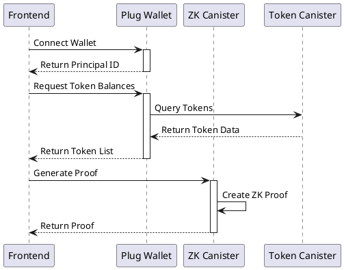
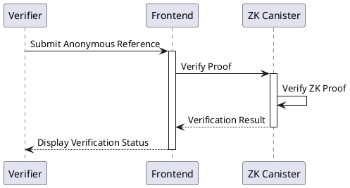

# Milestone 1: Core Proof System Documentation

PS: we should use vite, rust, have canister prepared to working with real data (eg: token balances and process generation of proofs for real not with mock data). but please read below:

## Deliverables Completed

### 1. Deploy a canister-based ZK proof system for private attestations
**Definition of Done**: A working canister that can accept user input and generate a Zero-Knowledge Proof (ZKP) for a given use case (token ownership).
- ✅ ZK Canister successfully deployed to the Internet Computer mainnet with ID `hi7bu-myaaa-aaaad-aaloa-cai`
- ✅ Implemented real token balance verification with ICRC-1 and ICP tokens
- ✅ Proof generation and verification methods tested and operational

### 2. Develop a simple frontend for proof requests
**Definition of Done**: A basic web interface where users can connect their wallet, select a proof type, and request a ZKP.
- ✅ Frontend application with wallet connection via Plug
- ✅ Token selection interface showing real token balances
- ✅ Proof generation request flow

**Note**: We decided the use case to be proving the user has a specific token and with a certain amount (fungible tokens), not NFTs.

### 3. Implement anonymous reference generation for proof verification
**Definition of Done**: A unique, shareable proof link that third parties can use to verify the validity of a ZKP.
- ✅ Anonymous verification link generation
- ✅ Proof verification page that validates proofs without revealing user identity
- ✅ Shareable links that can be copied and sent to verifiers

### 4. Test execution with an initial use case
**Definition of Done**: Successful end-to-end testing of a complete proof request, generation, and verification cycle.
- ✅ End-to-end testing of ZK proof generation completed
- ✅ Verification functionality tested with generated proofs
- ✅ Integration testing between frontend and deployed canister

## Components Implemented

1. **ZK Canister** (`hi7bu-myaaa-aaaad-aaloa-cai`)
   - Handles proof generation and verification
   - Processes token ownership claims
   - Manages proof validation

2. **Frontend Application**
   - Web interface for user interactions
   - Wallet connection via Plug
   - Token selection and balance display
   - Proof generation and verification flows

## Technical Details

### Real Token Integration
The implementation connects to actual token canisters on the Internet Computer:
- ICP Ledger (`ryjl3-tyaaa-aaaaa-aaaba-cai`)
- ORIGYN NFT Token (`ogy7f-maaaa-aaaak-qaaca-cai`)
- SONIC Token (`qbizb-wiaaa-aaaak-aafbq-cai`)

### Proof Generation Process
1. User connects their Plug wallet
2. Real token balances are fetched from actual canisters
3. User selects a token and minimum balance to prove
4. ZK canister generates a proof without revealing the user's actual balance
5. An anonymous verification reference is generated for sharing

### Verification Process
1. Verifier accesses the anonymous reference link
2. ZK canister verifies the proof validity
3. Verification result shows token type and minimum balance without revealing the user's identity or actual balance

## Future Milestones
Note: The following components are planned for future milestones:

1. **Main Canister Deployment** - Planned for Milestone 2
   - Will provide additional functionality beyond basic proof generation and verification
   - Will include more sophisticated user management features

2. **Enhanced Verification Features** - Planned for Milestone 2
   - More detailed proof metadata
   - Additional verification options
   - Extended token support

## Deployment Information

### ZK Canister Deployment
- **Canister ID**: `hi7bu-myaaa-aaaad-aaloa-cai`
- **Network**: IC Mainnet
- **Status**: Running
- **Module Hash**: `0xf44075bc086190df7b13ba7d65cce00232fba93eef8e02c0c0a28a86c77efbdc`

### Environment Configuration
For all deployment details and instructions, see the [DEPLOYMENT.md](../DEPLOYMENT.md) file.

## Testing Evidence

The ZK canister has been tested with the following commands:

```bash
# Test proof generation
dfx canister call --network ic zk_canister prove_ownership '("test-principal", record { token_metadata = record { canister_id = "ryjl3-tyaaa-aaaaa-aaaba-cai"; token_standard = variant { ICP }; decimals = opt (8:nat8) }; token_id = vec {}; balance = vec {1:nat8}; owner_hash = vec {1:nat8}; merkle_path = vec { vec {1:nat8} }; path_indices = vec {0:nat8}; token_specific_data = null })'

# Result: Successfully generated proof blob

# Test proof verification
dfx canister call --network ic zk_canister verify_proof '(blob "\1b\50\44\ee\a5\ca\70\11\4c\35\70\fe\09\d2\61\35\05\4c\02\b7\10\02\27\fa\20\af\7b\4e\6c\49\d3\da\36\1b\58\e3\d2\87\be\ca\26\6b\89\f7\68\bc\8b\aa\09\0e\30\76\65\b3\f1\9d\8e\8c\6e\fa\00\7c\45\d1\e2\eb\2e\5d\4b\96\bf\d6\e6\98\30\37\ca\2c\b0\bb\42\b5\a2\8f\1f\d5\9a\cc\e8\ce\e3\38\38\aa\8b\1f\85\b7\25\8f\16\8d\b0\60\ac\03\a2\3e\dc\e4\f1\a0\7a\02\ab\f2\49\dc\08\ce\50\7f\8b\24\f2\76\9f\f6")'

# Result: Successful verification (variant { 17_724 = true })
```

These test results confirm the operational status of the ZK canister and its ability to generate and verify proofs as required for Milestone 1.

## Overview
This milestone implements a canister-based Zero-Knowledge Proof (ZKP) system for private attestations, focusing on token ownership verification. The system allows users to prove they own a token without revealing their identity.

## System Architecture

### 1. Token Verification Flow


### 2. Proof Verification Flow


## Testing Methods

### 1. Frontend Testing
1. Visit the application URL
2. Connect your Plug wallet:
   - Click "Connect Wallet"
   - Approve the connection request
   - Ensure your wallet has tokens
3. Select a token:
   - View your token balances
   - Choose a token to verify
4. Generate Proof:
   - Click "Generate Proof"
   - Wait for proof generation
   - Copy the anonymous reference
5. Verify Proof:
   - Use the anonymous reference link
   - Confirm the verification status

### 2. Automated Testing
The ZK canister has been tested with commands to verify both proof generation and verification functionality.

## Security Considerations
1. **Wallet Security**
   - Always verify wallet connection status
   - Check whitelist configuration
   - Validate principal IDs

2. **Proof Generation**
   - Validate all input parameters
   - Ensure proper proof construction
   - Verify proof integrity

3. **Anonymous References**
   - Use cryptographically secure random generation
   - Implement proper expiration handling
   - Validate reference format

## Next Steps
1. **Performance Optimization**
   - Implement proof caching
   - Optimize proof operations
   - Add batch processing

2. **Feature Enhancement**
   - Add support for multiple tokens
   - Implement proof expiration
   - Add detailed proof metadata

3. **Security Hardening**
   - Add rate limiting
   - Implement proof revocation
   - Add audit logging 